  

# Hi, I'm svoja

Building hackathon projects, freelance tools, and school projects across
web, mobile, and applied ML.

## What I've been building

- **Hackathons** -- privacy-preserving mental health screening, offline ASL
  translation, medicine-label OCR for the visually impaired
- **Freelance** -- scheduling dashboards, logistics/mapping tools
- **School** -- booking platforms, e-commerce sites, group projects

Check out my pinned repos for the highlights.
